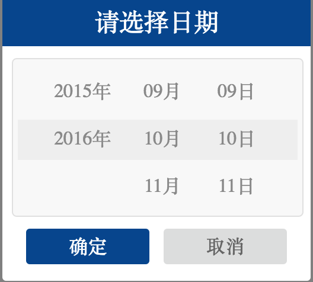
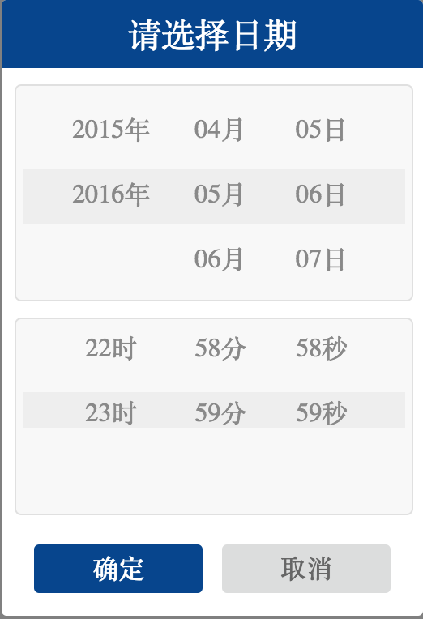

## H5滚动日历

基于iscroll编写的滚动日历插件，非常简单。直接按照例子来就可以使用,支持zepto,jquery。依赖于iscroll4.2.5版本，因为使用iscroll5体验及问题很多，遂放弃。

#### 目前版本：

1. jquery:1.9.1+
2. zepto:1.2.0

#### 使用：
$('xxx').date({},function(){},function(){});

#### 参数options:

- beginyear:起始年份（默认1900）
- endyear:结束年份 （默认当前年）
- curdate: 是否初始化始终转向当前日期
- theme:主题（默认'date',datetime）
- event: 事件类型（默认'click'）

一般配置上面这几个参数即可，下面的参数一般不建议修改；

- beginmonth: 起始月份
- endmonth: 结束月份
- beginday: 起始日
- endday: 结束日
- beginhour:起始时
- endhour: 结束时
- beginminute:起始分
- endminute: 结束分
- beginsecond: 起始秒
- endsecond:结束秒
- liH: item高度（与css设定一致，默认40px）
- show: 显示隐藏（默认显示）
- scrollConfig: iScroll4配置项

#### 回调函数:
默认配置项后接的第一个函数是选择确认按钮的回调，回传选着的日期字符串，第二个函数是选择取消按钮的回调。

#### 日历UI:
##### 年月日（date）

##### 年月日时分秒（datetime）

#### 参考demo:
- example.jquery.html
- example.zepto.html

